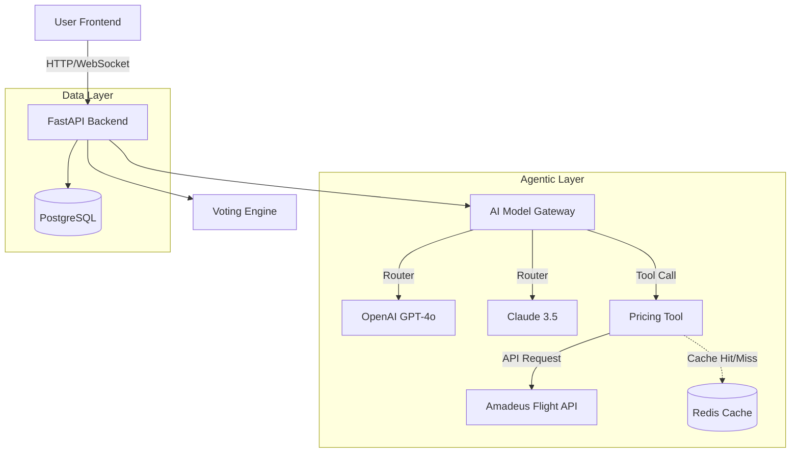

# Pack Vote: Agentic AI Travel Planner

**Pack Vote** is an agentic AI application that solves the group travel coordination problem. It moves beyond simple "chat wrappers" by implementing a **Multi-Model Gateway**, **Real-Time Tool Use (Function Calling)**, and a **Ranked Choice Voting Engine** to ensure fair decision-making.

## 🏗️ Architecture

The system is built as a modular monolith, designed for high cohesion and easy deployment while keeping the "AI Brain" decoupled from the "Product Logic."

### System Flow

1. **Intent Parsing:** The `ModelGateway` routes requests to the optimal LLM (OpenAI for complex reasoning, DeepSeek for speed).
2. **Tool Use Loop:** The agent autonomously queries the **Amadeus Flight API** to validate budget constraints, preventing hallucinated prices.
3. **Caching Layer:** A Redis "Cache-Aside" pattern reduces flight search latency from **~2.5s to ~50ms**.
4. **Voting Engine:** Implements the **Instant Runoff Voting (IRV)** algorithm to mathematically determine the most acceptable destination for the group.



## 🚀 Key Features

* **Multi-Model Gateway:** A unified interface that abstracts OpenAI, Anthropic, and DeepSeek, allowing for A/B testing prompts and cost-based routing.
* **Agentic Tool Use:** The LLM doesn't just guess; it "calls" Python functions to fetch real-time data before answering.
* **Ranked Choice Voting:** A custom implementation of the IRV algorithm (Python) visualized via Recharts (React).
* **Performance Engineering:**
* **Redis Caching:** Decorator-based caching for expensive API calls.
* **Optimistic UI:** React Query for instant feedback on voting actions.


## 🛠️ Tech Stack

### Backend

* **Language:** Python 3.10
* **Framework:** FastAPI (Async I/O)
* **Database:** PostgreSQL (SQLAlchemy) & Redis
* **AI/ML:** OpenAI SDK, Anthropic SDK, Amadeus API

### Frontend

* **Framework:** Next.js 14 (App Router)
* **Language:** TypeScript
* **State:** TanStack Query (React Query)
* **Visualization:** Recharts, Framer Motion
* **Styling:** Tailwind CSS + shadcn/ui

## ⚡ Getting Started

### Prerequisites

* Docker & Docker Compose
* Node.js 18+
* API Keys: OpenAI, Anthropic, Amadeus, Twilio (Optional)

### 1. Clone & Setup

```bash
git clone https://github.com/yourusername/pack-vote.git
cd pack-vote

```

### 2. Environment Variables

Create a `.env` file in the root directory:

```env
# Backend
OPENAI_API_KEY=sk-...
ANTHROPIC_API_KEY=sk-...
AMADEUS_CLIENT_ID=...
AMADEUS_CLIENT_SECRET=...
DATABASE_URL=postgresql://user:password@db:5432/packvote
REDIS_URL=redis://redis:6379/0

# Frontend
NEXT_PUBLIC_API_URL=http://localhost:8000

```

### 3. Run with Docker

Spin up the entire stack (FastAPI, Postgres, Redis):

```bash
docker-compose up --build

```

### 4. Run Frontend (Local)

```bash
cd web
npm install
npm run dev
# Open http://localhost:3000

```

## 🧪 Engineering Challenges & Solutions

### Challenge: LLM Hallucination

* **Problem:** The LLM would confidently recommend "$200 flights to Tokyo" that didn't exist.
* **Solution:** Implemented the **ReAct (Reasoning + Acting)** pattern. The `ModelGateway` forces the model to emit a `get_flight_price` tool call. The system pauses, executes the Python function against the Amadeus API, injects the real price into the context window, and *then* lets the model generate the final response.

### Challenge: API Latency

* **Problem:** Real-time pricing checks added 2-3 seconds of latency per turn, making the chat feel sluggish.
* **Solution:** Implemented a **Redis Cache-Aside** strategy. Flight queries are cached for 1 hour. Subsequent queries for the same route return in <50ms.

## 🔮 Future Roadmap

* [ ] **WebSocket Integration:** Replace polling with WebSockets for true real-time voting updates.
* [ ] **Calendar Agent:** Add a Google Calendar integration to find common free dates automatically.
* [ ] **Budget Tracking:** OCR for receipt splitting after the trip is booked.
